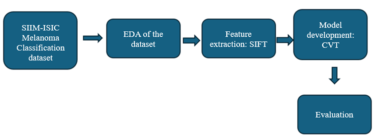
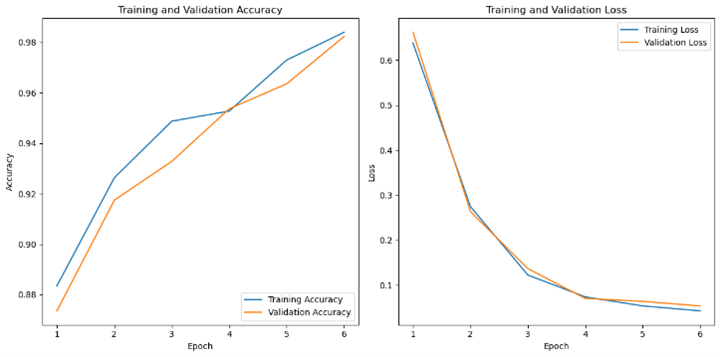
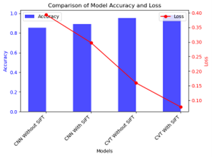

# Melanoma Detection using Convolutional Vision Transformer (CVT) and Scale-Invariant Feature Transform (SIFT)

## Introduction

Despite accounting for only 4% of skin cancer cases, melanoma is responsible for 75% of skin cancer deaths. Early detection is crucial as melanoma can be cured if treated in its early stages. This project aims to develop an automated diagnostic tool to assist clinicians in the early identification of melanoma using advanced deep learning techniques. Specifically, this project leverages the Convolutional Vision Transformer (CVT) combined with the Scale-Invariant Feature Transform (SIFT) for improved accuracy and reliability in melanoma detection.

## Aim

The main objective of this project is to create a precise and effective method for the early identification of melanoma by utilizing SIFT for feature extraction and CVT for classification.

## Objectives

- Perform a thorough examination and evaluation of current melanoma detection strategies.
- Obtain and preprocess a diverse dataset of melanoma images, ensuring representation across various skin types and stages.
- Refine the SIFT method for effective feature extraction from melanoma images.
- Develop a customized CVT architecture for melanoma classification using the extracted SIFT features.
- Assess the performance of the trained CVT model by evaluating its classification accuracy.
- Document the findings and provide recommendations for future work and clinical implementation.

## Methodology

The methodology begins with the utilization of the SIIM-ISIC Melanoma Classification dataset, followed by Exploratory Data Analysis (EDA) to gain insights into the data. SIFT is used to extract significant features from the images, which are then fed into a CVT model for classification. The model's performance is evaluated at an assessment stage, where accuracy and other relevant metrics are measured.

### Methodology Flowchart


## Libraries Used

- Python
- TensorFlow
- Keras
- OpenCV
- NumPy
- Matplotlib
- Scikit-learn
- TensorFlow Addons

## Dataset

The dataset used is the SIIM-ISIC Melanoma Classification dataset, a collection of 33,126 dermoscopic images of benign and malignant skin lesions. This dataset is specifically curated for melanoma recognition and diagnosis.

- **Dataset Link**: [Kaggle Melanoma Skin Cancer Dataset](https://www.kaggle.com/datasets/hasnainjaved/melanoma-skin-cancer-dataset-of-10000-images)
- **Original Source**: [ISIC Challenge 2020](https://challenge2020.isic-archive.com/)

## Results

### CVT + SIFT Model Performance

- **Training Accuracy**: The model achieves close to 98% accuracy by the 6th epoch.
- **Validation Accuracy**: The model's validation accuracy consistently increases, reaching 96% by the end of training.
- **Training Loss**: The training loss decreases steadily, converging near zero.
- **Validation Loss**: The validation loss follows a similar trend, stabilizing at 0.1, indicating successful generalization.



### Model Comparison

The comparison of model accuracy and loss across different configurations (CNN without SIFT, CNN with SIFT, CVT without SIFT, and CVT with SIFT) highlights the superior performance of the CVT with SIFT model, achieving 98% accuracy and the lowest loss of 0.10.



## How to Run the Code

1. **Clone the repository**:
   ```bash
   git clone https://github.com/your_username/your_repository.git
2. Install the above libraries
3. Go to cloned folder
4. Open final code file
5. run the code

